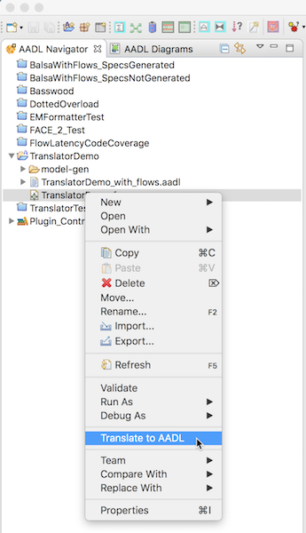
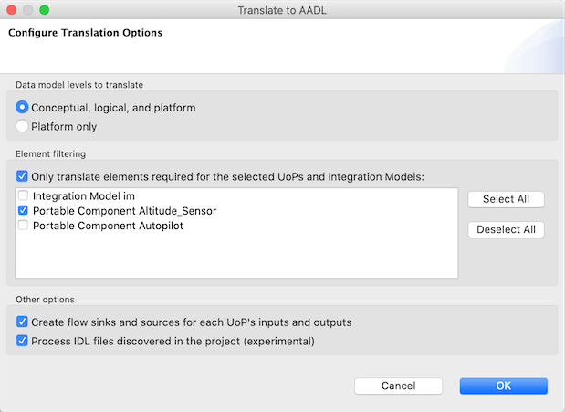

# FACE Data Model to AADL Translator

[TOC levels=2-4 bullet hierarchy]

## Introduction

The FACE Data Model to AADL Translator converts a FACE 3.0 “.face” file into an AADL 2.2 model. It translates
the Data Model, UoP Model, and Integration Model. The translator produces data classifiers for the Data
Model, thread groups for the UoP Model, and a system component for the Integration Model. The system contains
subcomponents for the UoPs and Transport Nodes and connections between these subcomponents.

The purpose of the translator is to enable developers of FACE components to utilize the analytical
capabilities of AADL. The architectural information included in the FACE model is captured and expressed in
the resulting AADL model. This model can then be extended by the user to add various properties and then
analyzed. The existence of the FACE Data Model to AADL Translator allows for changes in the FACE model to be
quickly realized in the AADL model and then analyzed.

The FACE Data Model to AADL Translator is a set of plugins to OSATE. The translator integrates with the OSATE
modeling environment and is invoked from within OSATE.

DISCLAIMER:  The FACE Data Model to AADL Translator is intended to support the development of FACE™ software
or support the integration of certified FACE conformant software into a system or subsystem.  The FACE Data
Model to AADL Translator is not to be perceived as FACE Conformant, and has not been vetted or approved by
The Open Group FACE Consortium.   The Open Group does not in any way, explicitly or implicitly, warrant or
endorse the FACE Data Model to AADL Translator. The Open Group does not accept any liability for the accuracy
of the FACE Data Model to AADL Translator.

## How to use

To translate a FACE file into AADL, do the following:

* Place a **.face** file in an AADL project.
* Right-click the **.face** file in the AADL Navigator.
* Select **Translate to AADL**. This will open a dialog for configuring the translation options.
* In the dialog, [configure the translation options](#translation-options) or accept the defaults and click
  **OK**.
* The translator will create a folder called **model-gen** which contains the AADL files.

## Translation options

The translator has a few options for configuring the resulting AADL model. There are options for selecting
which parts of the data model should be translated, which UoPs and integration models should be translated, if
flow sinks and sources should be created for the UoPs, and if IDL files should be processed.

### Data model levels

By default, the translator will translate every translatable data model element in the FACE model. The list of
translatable data model elements is described [below](#data-model-translation). If a FACE model contains many
conceptual and logical data model elements which are not useful for analyzing the AADL model, they can be
omitted from translation. The option **Platform only** will not translate any conceptual or logical elements.

When this option is selected, platform data elements which realize a logical data element will be translated
with a comment indicating that the extension of the logical element is not translated. Normally, such a
realization produces a data type extension in AADL.

### Element filtering

By default, the translator will translate every UoP and integration model. The translator can be configured to
translate only a subset of the available UoPs and integration models. To enable this option, check
**Only translate elements required for the selected UoPs and Integration Models** and select the elements that
should be translated.

The translator will translate the selected elements and any UoPs or data model elements which are required for
the translation. Data model elements not used by the selection will not be translated. For UoPs, it is
possible for a UoP to be translated even if it is not selected. This happens when the UoP is required by a
selected integration model.

### Flows

By default, the translator will create a flow sink for every UoP input and a flow source for every UoP output.
These flow sinks and sources will be on the resulting process classifiers. The purpose of these flow
declarations is to make it easier to extend the generated model and add end to end flows. If this is not
desirable, then the creation of these flows can be disabled.

### IDL Processing (experimental)

By default, the translator will create an empty data type and implementation for each
**face.datamodel.platform.PhysicalDataType** and **face.datamodel.platform.Template**. By selecting this option,
the translator will fill these types and implementations with more information such as their specific data
representations and subcomponents. The translator discovers this information by processing IDL
files which have been generated by the Conformance Test Suite. The expectation is that the user will
generate the IDL files, and then copy them into the project. The translator will then search through all of
the IDL files for a declaration corresponding to a **PhysicalDataType** or **Template**. If an IDL declaration
could not be found, a data type and implementation is still produced, but with a comment indicating that the
IDL declaration could not be found. An info message is also reported to the error log.

The information gathered from the IDL files is the same as the information contained in the Query and Template
languages found within the FACE file. From an implementation perspective, it is simpler to process this
information in its IDL format rather than processing Query and Template. The IDL parser within the translator
is simplified and is only intended to parse IDL which is generated by the Conformance Test Suite and cannot
handle general IDL files.

## Translation details

The translator produces up to four AADL files in the **model-gen** directory. The name of each AADL file is
based on the name of the FACE file. If the name of the FACE file is not a legal identifier, then the name of
the AADL file is a sanitized version of the FACE file name. The contents of each file are the following:

* ***\<FACE file name\>*_data_model.aadl**: Data model elements.
* ***\<FACE file name\>*_PSSS.aadl**: UoPs that are platform specific components.
* ***\<FACE file name\>*_PCS.aadl**: UoPs that are portable components.
* ***\<FACE file name\>*_integration_model.aadl**: An AADL system representing the integration model.

### Data model translation

The following describes how various elements of the data model are translated.

#### face.datamodel.conceptual.ComposableElement

* Each **ComposableElement** is translated into a data type.
* The **name** field is used to create the name of the data type. The data type's name is
  ***\<name\>*_Conceptual**.
* The **description** field is translated into a comment on the data type.
* The property **FACE::Realization_Tier** is set to the value **conceptual**.
* If the FACE file was generated using UUIDs, then the property **FACE::UUID** is set to the ID of the
  **ComposableElement**.

#### face.datamodel.conceptual.Query

* Each **Query** is translated into a data type.
* The **name** field is used to create the name of the data type. The data type's name is
  ***\<name\>*_Conceptual**.
* The **description** field is translated into a comment on the data type.
* The property **FACE::Realization_Tier** is set to the value of **conceptual**.
* If the FACE file was generated using UUIDs, then the property **FACE::UUID** is set to the ID of the
  **Query**.

#### face.datamodel.conceptual.CompositeQuery

* Each **CompositeQuery** is translated into a data type.
	* The **name** field is used to create the name of the data type. The data type's name is
	  ***\<name\>*_Conceptual**.
	* The **description** field is translated into a comment on the data type.
	* If the **isUnion** field is set to **true**, then the property **FACE::Is_Union** is set to the value
	  **true**.
	* The property **FACE::Realization_Tier** is set to the value of **conceptual**.
	* If the FACE file was generated using UUIDs, then the property **FACE::UUID** is set to the ID of the
	  **CompositeQuery**.
* Each **CompositeQuery** is also translated into a data implementation which implements the data type.
	* The **name** field is used to create the name of the data implementation. The data implementation's
	  name is ***\<name\>*_Conceptual.impl**.
	* Each **composition** *(face.datamodel.conceptual.QueryComposition)* is translated into a data
	  subcomponent of the data implementation.
		* The **rolename** field is translated into the name of the data subcomponent.
		* The **type** field is translated into the subcomponent's data classifier reference.
		* If the FACE file was generated using UUIDs, then the property **FACE::UUID** is set to the ID of
		  the **QueryComposition**.

#### face.datamodel.logical.Entity

* Each **Entity** is translated into a data type.
* The **name** field is used to create the name of the data type. The data type's name is
  ***\<name\>*_Logical**.
* The **description** field is translated into a comment on the data type.
* The **realizes** field is translated into the data type's extension reference.
* The property **FACE::Realization_Tier** is set to the value of **logical**.
* If the FACE file was generated using UUIDs, then the property **FACE::UUID** is set to the ID of the
  **Entity**.

#### face.datamodel.logical.Query

* Each **Query** is translated into a data type.
* The **name** field is used to create the name of the data type. The data type's name is
  ***\<name\>*_Logical**.
* The **description** field is translated into a comment on the data type.
* If the **realizes** field is set, then it is translated into the data type's extension reference.
* The property **FACE::Realization_Tier** is set to the value of **logical**.
* If the FACE file was generated using UUIDs, then the property **FACE::UUID** is set to the ID of the
  **Query**.

#### face.datamodel.logical.CompositeQuery

* Each **CompositeQuery** is translated into a data type.
	* The **name** field is used to create the name of the data type. The data type's name is
	  ***\<name\>*_Logical**.
	* The **description** field is translated into a comment on the data type.
	* If the **realizes** field is set, then it is translated into the data type's extension reference.
	* If the **isUnion** field is set to **true**, then the property **FACE::Is_Union** is set to the value
	  **true**.
	* The property **FACE::Realization_Tier** is set to the value of **logical**.
	* If the FACE file was generated using UUIDs, then the property **FACE::UUID** is set to the ID of the
	  **CompositeQuery**.
* Each **CompositeQuery** is also translated into a data implementation which implements the data type.
	* The **name** field is used to create the name of the data implementation. The data implementation's
	  name is ***\<name\>*_Logical.impl**.
	* Each **composition** *(face.datamodel.logical.QueryComposition)* is translated into a data subcomponent
	  of the data implementation.
		* The **rolename** field is translated into the name of the data subcomponent.
		* The **type** field is translated into the subcomponent's data classifier reference.
		* If the FACE file was generated using UUIDs, then the property **FACE::UUID** is set to the ID of
		  the **QueryComposition**.

#### face.datamodel.platform.PhysicalDataType

* Each **PhysicalDataType** is translated into a data type.
	* The **name** field is used to create the name of the data type. The data type's name is
	  ***\<name\>*_Platform**.
	* The **description** field is translated into a comment on the data type.
	* The property **FACE::Realization_Tier** is set to the value of **platform**.
	* If the FACE file was generated using UUIDs, then the property **FACE::UUID** is set to the ID of the
	  **PhysicalDataType**.
	* If IDL processing was enabled and this **PhysicalDataType** corresponds to an IDL definition, then data
    representation information is added to the data type through an extension, a property, or both.
		* If the IDL definition is a `short`, then the data type will extend from **Base_Types::Integer_16**.
		* If the IDL definition is a `long`, then the data type will extend from **Base_Types::Integer_32**.
		* If the IDL definition is a `long long`, then the data type will extend from **Base_Types::Integer_64**.
		* If the IDL definition is an `unsigned short`, then the data type will extend from
		  **Base_Types::Unsigned_16**.
		* If the IDL definition is an `unsigned long`, then the data type will extend from
		  **Base_Types::Unsigned_32**.
		* If the IDL definition is an `unsigned long long`, then the data type will extend from
		  **Base_Types::Unsigned_64**.
		* If the IDL definition is a `float`, then the data type will extend from **Base_Types::Float_32**.
		* If the IDL definition is a `double`, then the data type will extend from **Base_Types::Float_64**.
		* If the IDL definition is a `long double`, then the data type will extend from **Base_Types::Float**.
		* If the IDL definition is a `char`, then the data type will extend from **Base_Types::Character**.
		* If the IDL definition is a `boolean`, then the data type will extend from **Base_Types::Boolean**.
		* If the IDL definition is a `string`, then the data type will extend from **Base_Types::String**.
		* If the IDL definition is a `string` with a size, then the data type will extend from
		  **Base_Types::String** and have the **Data_Size** property set to the number of bytes in the string.
		* If the IDL definition is an `enum`, then the data type will have the **Data_Model::Data_Representation**
		  property set to **Enum**.
		* If the IDL definition is an `octet`, then the data type will have the **Data_Size** property set to
		  **8 bits**.
		* If the IDL definition is `fixed`, then the data type will have the **Data_Model::Data_Representation**
		  property set to **Fixed**.
* Each **PhysicalDataType** is also translated into a data implementation which implements the data type.
	* If IDL processing was enabled and this **PhysicalDataType** corresponds to a `struct` in IDL, then each
	  member of the struct is translated into a data subcomponent.
		* If the struct member is a `sequence` or an array, then the data subcomponent will be an array as well.

#### face.datamodel.platform.Entity

* Each **Entity** is translated into a data type.
* The **name** field is used to create the name of the data type. The data type's name is
  ***\<name\>*_Platform**.
* The **description** field is translated into a comment on the data type.
* If translating all data model levels, then the **realizes** field is translated into the data type's
  extension reference.
* The property **FACE::Realization_Tier** is set to the value of **platform**.
* If the FACE file was generated using UUIDs, then the property **FACE::UUID** is set to the ID of the
  **Entity**.

#### face.datamodel.platform.Template

* Each **Template** is translated into a data type.
	* The **name** field is used to create the name of the data type. The data type's name is
	  ***\<name\>*_Platform**.
	* The **description** field is translated into a comment on the data type.
	* If translating all data model levels, the **boundQuery** field is set, and its **realizes** field is set,
	  then it is translated into the data type's extension reference.
	* The property **FACE::Realization_Tier** is set to the value of **platform**.
	* If the FACE file was generated using UUIDs, then the property **FACE::UUID** is set to the ID of the
	  **Template**.
* Each **Template** is also translated into a data implementation which implements the data type.
	* If IDL processing was enabled and this **Template** corresponds to a `struct` in IDL, then each
	  member of the struct is translated into a data subcomponent.
		* If the struct member is a `sequence` or an array, then the data subcomponent will be an array as well.

#### face.datamodel.platform.CompositeTemplate

* Each **CompositeTemplate** is translated into a data type.
	* The **name** field is used to create the name of the data type. The data type's name is
	  ***\<name\>*_Platform**.
	* The **description** field is translated into a comment on the data type.
	* If translating all data model levels and the **realizes** field is set, then it is translated into the
	  data type's extension reference.
	* If the **isUnion** field is set to **true**, then the property **FACE::Is_Union** is set to the value
	  **true**.
	* The property **FACE::Realization_Tier** is set to the value of **platform**.
	* If the FACE file was generated using UUIDs, then the property **FACE::UUID** is set to the ID of the
 	  **CompositeTemplate**.
* Each **CompositeTemplate** is also translated into a data implementation which implements the data type.
	* The **name** field is used to create the name of the data implementation. The data implementation's
	  name is ***\<name\>*_Platform.impl**.
	* Each **composition** *(face.datamodel.platform.TemplateComposition)* is translated into a data
	  subcomponent of the data implementation.
		* The **rolename** field is translated into the name of the data subcomponent.
		* The **type** field is translated into the subcomponent's data classifier reference.
		* If the FACE file was generated using UUIDs, then the property **FACE::UUID** is set to the ID of
		  the **TemplateComposition**.

#### Example data model

The following is an example of a translated data model:

	--Generated from "TranslatorDemo.face" at 2018-06-11T13:10:25.338895
	package TranslatorDemo_data_model
	public
	  with FACE;
	
	  --Basic altitude type
	  data Altitude_Conceptual
	    properties
	      FACE::Realization_Tier => conceptual;
	  end Altitude_Conceptual;
	
	  --Altitude in meters
	  data Altitude_m_Logical extends Altitude_Conceptual
	    properties
	      FACE::Realization_Tier => logical;
	  end Altitude_m_Logical;
	
	  --Altitude in feet
	  data Altitude_ft_Logical extends Altitude_Conceptual
	    properties
	      FACE::Realization_Tier => logical;
	  end Altitude_ft_Logical;
	
	  --Double precision floating point in meters
	  data Altitude_m_Platform extends Altitude_m_Logical
	    properties
	      FACE::Realization_Tier => platform;
	  end Altitude_m_Platform;
	
	  --Double precision floating point in feet
	  data Altitude_ft_Platform extends Altitude_ft_Logical
	    properties
	      FACE::Realization_Tier => platform;
	  end Altitude_ft_Platform;
	end TranslatorDemo_data_model;

### UoP model translation

The following describes how UoPs are translated.

#### face.uop.UnitOfPortability

* Each **UnitOfPortability** is translated into a thread group type.
	* The **name** field is translated into the name of the thread group type.
	* The **description** field is translated into a comment on the thread group type.
	* The **faceProfile** field is translated into the property **FACE::Profile**. The possible values for
	  this property are **general**, **security**, **safety**, and **safety_extended**.
	* The property **FACE::Segment** is set a value based on the type of UoP. If the UoP is a
	  **face.uop.PlatformSpecificComponent**, then the value is **PSSS**. If the UoP is a
	  **face.uop.PortableComponent**, then the value is **PCS**.
	* If the FACE file was generated using UUIDs, then the property **FACE::UUID** is set to the ID of the
	  **UnitOfPortability**.
	* Each **connection** that is a **face.uop.ClientServerConnection** is translated into an event data port
	  for the request of the thread group type.
		* The **name** field is used to create the name of the port. The port's name is
		  ***\<name\>*_request**.
		* The **description** field is translated into a comment on the port.
		* The **role** field is translated into the direction of the port. If the role is **Client**, then
		  the direction is **out**. If the role is **Server**, then the direction is **in**.
		* The **requestType** field is translated into the port's data classifier reference.
		* The **period** field is converted to a frequency, then translated into either the **Input_Rate** or
		  **Output_Rate** property. Which property is set depends upon the **role** field. The frequency is
		  set as both the lower bound and upper bound of the record field **Value_Range**. The record field
		  **Rate_Unit** is set to **PerSecond**.
		* If the FACE file was generated using UUIDs, then the property **FACE::UUID** is set to the ID of
		  the **ClientServerConnection**.
	* Each **connection** that is a **face.uop.ClientServerConnection** is also translated into an event data
	  port for the response of the thread group type.
		* The **name** field is used to create the name of the port. The port's name is
		  ***\<name\>*_response**.
		* The **description** field is translated into a comment on the port.
		* The **role** field is translated into the direction of the port. If the role is **Client**, then
		  the direction is **in**. If the role is **Server**, then the direction is **out**.
		* The **responseType** field is translated into the port's data classifier reference.
		* The **period** field is converted to a frequency, then translated into either the **Input_Rate** or
		  **Output_Rate** property. Which property is set depends upon the **role** field. The frequency is
		  set as both the lower bound and upper bound of the record field **Value_Range**. The record field
		  **Rate_Unit** is set to **PerSecond**.
		* If the FACE file was generated using UUIDs, then the property **FACE::UUID** is set to the ID of
		  the **ClientServerConnection**.
	* Each **connection** that is a **face.uop.QueuingConnection** is translated into an event data port of
	  the thread group type.
		* The **name** field is translated into the name of the port.
		* The **description** field is translated into a comment on the port.
		* The **messageExchangeType** field is translated into the direction of the port.
		* The **messageType** field is translated into the port's data classifier reference.
		* The **period** field is converted to a frequency, then translated into either the **Input_Rate** or
		  **Output_Rate** property. Which property is set depends upon the **messageExchangeType** field. The
		  frequency is set as both the lower bound and upper bound of the record field **Value_Range**. The
		  record field **Rate_Unit** is set to **PerSecond**.
		* The **depth** field is translated into the value of the property **Queue_Size**.
		* If the FACE file was generated using UUIDs, then the property **FACE::UUID** is set to the ID of
		  the **QueuingConnection**.
	* Each **connection** that is a **face.uop.SingleInstanceMessageConnection** is translated into a data
	  port of the thread group type.
		* The **name** field is translated into the name of the port.
		* The **description** field is translated into a comment on the port.
		* The **messageExchangeType** field is translated into the direction of the port.
		* The **messageType** field is translated into the port's data classifier reference.
		* The **period** field is converted to a frequency, then translated into either the **Input_Rate** or
		  **Output_Rate** property. Which property is set depends upon the **messageExchangeType** field. The
		  frequency is set as both the lower bound and upper bound of the record field **Value_Range**. The
		  record field **Rate_Unit** is set to **PerSecond**.
		* If the FACE file was generated using UUIDs, then the property **FACE::UUID** is set to the ID of
		  the **SingleInstanceMessageConnection**.
* Each **UnitOfPortability** is also translated into a thread group implementation which implements the
  thread group type.
	* The **name** field is used to create the name of the thread group implementation. The thread group
	  implementation's name is ***\<name\>*.impl**.
	* Each **thread** *(face.uop.Thread)* is translated into a thread subcomponent of the thread group
	  implementation.
		* The name of the thread subcomponent is generated from the index of the **Thread** in the
		  **UnitOfPortability**. The name is **thread\<index\>**.
		* The **period** field is translated into the property **Period**.
* Each **UnitOfPortability** is also translated into a process type.
	* The **name** field is used to create the name of the process type. The process type's name is
	  ***\<name\>*_process**.
	* Each **connection** *(face.uop.Connection)* is translated into a port of the process type. The
	  translation of the port of the process type exactly matches the port of the thread group type.
	* If creating flows, then a flow source is created for each out port of the process type. The name of the
	  flow source is ***\<port name\>*_source**.
	* If creating flows, then a flow sink is created for each in port of the process type. The name of the
	  flow sink is ***\<port name\>*_sink**.
* Each **UnitOfPortability** is also translated into a process implementation which implements the process
  type.
	* The **name** field is used to create the name of the process implementation. The process
	  implementation's name is ***\<name\>*_process.impl**.
	* A thread group subcomponent is created which refers to the translated thread group implementation. The
	  name of the thread group subcomponent is the **name** field of the **UnitOfPortability**.
	* A port connection is created for each port of the thread group type. The connection maps the port of
	  the thread group type to its corresponding port of the process type. The name of the connection is
	  ***\<port name\>*_connection**.
	* A flow source implementation is created for each flow source of the process type.
	* A flow sink implementation is created for each flow sink of the process type.

#### Example UoP model

The following is an example of a translated UoP model:

	--Generated from "TranslatorDemo.face" at 2018-06-11T13:10:25.338895
	package TranslatorDemo_PCS
	public
	  with FACE;
	  with TranslatorDemo_data_model;
	
	  thread group Altitude_Sensor
	    features
	      Altitude_output: out event data port TranslatorDemo_data_model::Altitude_ft_Platform {
	        Output_Rate => [Value_Range => 8.0 .. 8.0; Rate_Unit => PerSecond;];
	        Queue_Size => 10;
	      };
	    properties
	      FACE::Profile => general;
	      FACE::Segment => PCS;
	  end Altitude_Sensor;
	
	  thread group implementation Altitude_Sensor.impl
	    subcomponents
	      thread0: thread {
	        Period => 125 ms;
	      };
	  end Altitude_Sensor.impl;
	
	  process Altitude_Sensor_process
	    features
	      Altitude_output: out event data port TranslatorDemo_data_model::Altitude_ft_Platform {
	        Output_Rate => [Value_Range => 8.0 .. 8.0; Rate_Unit => PerSecond;];
	        Queue_Size => 10;
	      };
	    flows
	      Altitude_output_source: flow source Altitude_output;
	  end Altitude_Sensor_process;
	
	  process implementation Altitude_Sensor_process.impl
	    subcomponents
	      Altitude_Sensor: thread group Altitude_Sensor.impl;
	    connections
	      Altitude_output_connection: port Altitude_Sensor.Altitude_output -> Altitude_output;
	    flows
	      Altitude_output_source: flow source Altitude_Sensor -> Altitude_output_connection -> Altitude_output;
	  end Altitude_Sensor_process.impl;
	
	  thread group Autopilot
	    features
	      Altitude_input: in event data port TranslatorDemo_data_model::Altitude_m_Platform {
	        Input_Rate => [Value_Range => 8.0 .. 8.0; Rate_Unit => PerSecond;];
	        Queue_Size => 10;
	      };
	    properties
	      FACE::Profile => general;
	      FACE::Segment => PCS;
	  end Autopilot;
	
	  thread group implementation Autopilot.impl
	    subcomponents
	      thread0: thread {
	        Period => 125 ms;
	      };
	  end Autopilot.impl;
	
	  process Autopilot_process
	    features
	      Altitude_input: in event data port TranslatorDemo_data_model::Altitude_m_Platform {
	        Input_Rate => [Value_Range => 8.0 .. 8.0; Rate_Unit => PerSecond;];
	        Queue_Size => 10;
	      };
	    flows
	      Altitude_input_sink: flow sink Altitude_input;
	  end Autopilot_process;
	
	  process implementation Autopilot_process.impl
	    subcomponents
	      Autopilot: thread group Autopilot.impl;
	    connections
	      Altitude_input_connection: port Altitude_input -> Autopilot.Altitude_input;
	    flows
	      Altitude_input_sink: flow sink Altitude_input -> Altitude_input_connection -> Autopilot;
	  end Autopilot_process.impl;
	end TranslatorDemo_PCS;

### Integration model translation

The following describes how integration models are translated.

#### face.integration.IntegrationModel

* Each **IntegrationModel** is translated into a system type.
	* The **name** field is translated into the name of the system type.
	* The **description** field is translated into a comment on the system type.
	* If the FACE file was generated using UUIDs, then the property **FACE::UUID** is set to the ID of the
	  **IntegrationModel**.
* Each **IntegrationModel** is translated into a system implementation which implements the system type.
	* The **name** field is used to create the name of the system implementation. The system implementation's
	  name is ***\<name\>*.impl**.
	* Each **face.integration.UoPInstance** of the **IntegrationModel** is translated into a process
	  subcomponent.
		* The **name** field is translated into the name of the process subcomponent.
		* The **description** field is translated into a comment on the processs subcomponent.
		* The **realizes** field is translated into the subcomponent's process classifier reference.
		* If the FACE file was generated using UUIDs, then the property **FACE::UUID** is set to the ID of
		  the **UoPInstance**.
	* Each **face.integration.TransportChannel** of the **IntegrationModel** is translated into a virtual bus
	  subcomponent.
		* The **name** field is translated into the name of the virtual bus subcomponent.
		* The **description** field is translated into a comment on the virtual bus subcomponent.
		* If the FACE file was generated using UUIDs, then the property **FACE::UUID** is set to the ID of
		  the **TransportChannel**.
	* Each **face.integration.TransportNode** of each **face.integration.IntegrationContext** of the
	  **IntegrationModel** is translated into an abstract subcomponent.
		* The **name** field is translated into the name of the abstract subcomponent.
		* The **name** field is translated into the subcomponent's abstract classifier reference.
	* Each **face.integration.TSNodeConnection** of each **face.integration.IntegrationContext** of the
	  **IntegrationModel** is translated into a connection.
		* The name of the connection is generated from the index of the **TSNodeConnection** in the
		  **IntegrationModel**. The name is **connection\<index\>**.
		* Every path between UoPs that includes the **TSNodeConnection** is analyzed to determine the connection kind.
			* If the UoP endpoints for the paths are all translated as data ports, then this connection will be a port
			  connection.
			* If the UoP endpoints for the paths are all translated as event data ports, then this connection will be a
			  port connection.
			* If the UoP endpoints for the paths are not all of the same kind, then this feature will be a feature
			  connection.
		* The **source** field is translated into the source of the connection.
		* The **destination** field is translated into the destination of the connection.
		* IF the FACE file was generated using UUIDs, then the property **FACE::UUID** is set to the ID of
		  the **TSNodeConnection**.

#### face.integration.TransportNode

* Each **TransportNode** is translated into an abstract type.
* The **name** field is translated into the name of the abstract type.
* The **description** field is translated into a comment on the abstract type.
* The property **FACE::Segment** is set to the value of **TSS**.
* If the FACE file was generated using UUIDs, then the property **FACE::UUID** is set to the ID of the
  **TransportNode**.
* Each **inPort** *(face.integration.TSNodeInputPort)* is translated into an in feature of the abstract type.
	* The name of the feature is generated from the index of the **TSNodeInputPort** in the
	  **TransportNode**.
	* Every path between UoPs that includes the **TransportNode** is analyzed to determine the feature kind.
		* If the UoP endpoints for the paths are all translated as data ports, then this feature will be a data port.
		* If the UoP endpoints for the paths are all translated as event data ports, then this feature will be an event
		  data port.
		* If the UoP endpoints for the paths are not all of the same kind, then this feature will be an abstract
		  feature.
	* The **view** field is translated into the feature's data classifier reference.
	* If the FACE file was generated using UUIDs, then the property **FACE::UUID** is set to the ID of the
	  **TSNodeInputPort**.
* If the **TransportNode** has an **outPort** *(face.integration.TSNodeOutputPort)*, then the **outPort** is
  translated into an out feature of the abstract type.
	* The name of the feature is **output**.
	* Every path between UoPs that includes the **TransportNode** is analyzed to determine the feature kind.
		* If the UoP endpoints for the paths are all translated as data ports, then this feature will be a data port.
		* If the UoP endpoints for the paths are all translated as event data ports, then this feature will be an event
		  data port.
		* If the UoP endpoints for the paths are not all of the same kind, then this feature will be an abstract
		  feature.
	* The **view** field is translated into the feature's data classifier reference.
	* IF the FACE file was generated using UUIDs, then the property **FACE::UUID** is set to the ID of the
	  **TSNodeOutputPort**.

#### Example integration model

The following is an example of a translated integration model:

	--Generated from "TranslatorDemo.face" at 2018-06-11T13:10:25.338895
	package TranslatorDemo_integration_model
	public
	  with FACE;
	  with TranslatorDemo_data_model;
	  with TranslatorDemo_PCS;
	
	  system im
	  end im;
	
	  system implementation im.impl
	    subcomponents
	      Altitude_Sensor: process TranslatorDemo_PCS::Altitude_Sensor_process.impl;
	      Autopilot: process TranslatorDemo_PCS::Autopilot_process.impl;
	      Channel: virtual bus;
	      Converter_ft_to_m: abstract Converter_ft_to_m;
	      Transporter: abstract Transporter;
	    connections
	      connection0: port Altitude_Sensor.Altitude_output -> Converter_ft_to_m.input0;
	      connection1: port Converter_ft_to_m.output -> Transporter.input0;
	      connection2: port Transporter.output -> Autopilot.Altitude_input;
	  end im.impl;
	
	  abstract Converter_ft_to_m
	    features
	      input0: in event data port TranslatorDemo_data_model::Altitude_ft_Platform;
	      output: out event data port TranslatorDemo_data_model::Altitude_m_Platform;
	    properties
	      FACE::Segment => TSS;
	  end Converter_ft_to_m;
	
	  abstract Transporter
	    features
	      input0: in event data port TranslatorDemo_data_model::Altitude_m_Platform;
	      output: out event data port TranslatorDemo_data_model::Altitude_m_Platform;
	    properties
	      FACE::Segment => TSS;
	  end Transporter;
	end TranslatorDemo_integration_model;

## Extending the generated AADL model

The translator produces a basic model from the information in the FACE file. This model is intended to be
extended and for more information to be added to the extension. This may include properties, modes, hardware
components, flows, etc. Ideally, the generated model should not be modified. Any modifications to the
generated models will be overwritten if the translation is executed again.

The following is an example of extending a generated model to add an end to end flow:

	package TranslatorDemo_with_flows
	public
	  with TranslatorDemo_integration_model;
	
	  renames system TranslatorDemo_integration_model::im;
	
	  system implementation im.with_flows extends TranslatorDemo_integration_model::im.impl
	    flows
	      Sensor_to_Autopilot: end to end flow Altitude_Sensor.Altitude_output_source -> connection0 ->
	        Converter_ft_to_m -> connection1 ->
	        Transporter -> connection2 ->
	        Autopilot.Altitude_input_sink;
	  end im.with_flows;
	end TranslatorDemo_with_flows;

This example shows an end to end flow originating from the UoP `Altitude_Sensor`, moving through the transport
nodes `Converter_ft_to_m` and `Transporter`, and ending at the UoP `Autopilot`. The referenced AADL package
`TranslatorDemo_integration_model` is included as an
[example of a translated integration model](#example-integration-model).